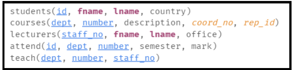

Web Lab 14 &ndash; Databases 2
==========

Begin by forking this repository into your namespace by clicking the ```fork``` button above, then selecting your username from the resulting window. 
Once completed, click the ```clone``` button, copy the ```Clone with HTTPS``` value. Open IntelliJ, and from the welcome screen 
click ```Check out from Version Control -> Git```, then paste the copied URL into the ```URL``` field of the resulting window. 
Provide your GitLab username and password if prompted.

Explore the files in the project, familiarizing yourself with the content.

Preamble
----------

The online tutorial for SQL we make use of is the one at TutorialsPoint:

 - [http://www.tutorialspoint.com/sql/](http://www.tutorialspoint.com/sql/)

of which the PDF version is at:

 - [http://www.tutorialspoint.com/sql/sql_tutorial.pdf](http://www.tutorialspoint.com/sql/sql_tutorial.pdf)
 
 In this lab you will be writing SQL statements in the exercises below on your own PC, then executing them on a remote server to which you have limited access. 
 If you encounter an issue with your permissions during these exercise, please talk to your lecturer and they will help you resolve the problem. 
 
 In reading through the highlighted sections of the online tutorial, if you want to try out some examples for yourself of the 
 sorts of SQL statements you are reading about, then there are some websites that allow you to try out example syntax “live”. 
 The Try it yourself feature of W3Schools that you have most likely encountered for JavaScript and CSS, for instance, is also provided for SQL:

- [http://www.w3schools.com/sql/sql_intro.asp](http://www.w3schools.com/sql/sql_intro.asp)

Most mainstream web browsers are compatible with the site for entering SQL select statements, as these only need to read information from a database. 
To try out statements that create tables and modify values, then W3Schools needs you to be using a web browser with WebSQL support: 
Chrome, Safari, or Opera (at the time or writing).

Getting Started
----------

Before you can begin executing your SQL, you will need to connect to the target database. 
There are two ways to do this, and it is suggested that you ensure that both work for you.

### Connecting via a web interface:

The hosted MariaDB server instance has the phpmyadmin management interface installed and accessible to you. To connect to 
this, visit [https://trex-sandwich.com/db/](https://trex-sandwich.com/db/) and log in using the username and password supplied to you by your lecturer.

Familiarize yourself with this interface and experiment with the various interface tabs. You will find that if you select your database from the left of the 
interface, you will be able to execute arbitrary SQL commands on that database, or use wizards to create tables and queries.

### Connecting via IntelliJ:

Open your SQL project, then open the “Database” tab from the `View | Tool Window | Database` menu. In the Database tab, click the green “+” button and select 
Data Source | MariaDB from the menu. In the “Data Sources and Drivers” window, set the “Host” field to `db.trex-sandwich.com` . In the “Database” and “User” fields, 
supply your provided username, and fill in your password. Finally, if you see the following message at the bottom of the window:


Click the “Download” link to let IntelliJ fetch the appropriate drivers, then click the “Test Connection”
 button. If this succeeds, hit “Apply” then “OK” to complete the configuration; otherwise talk to your
  lecturer for assistance.

You will now be able to execute SQL statements on the remote server directly from your editor window.

Exercise One
----------

In this exercise you will create an ER diagram, relational schema and SQL required for the database outlined below. 
Read the explanation carefully and use the UniDB example from the lecture slides to help you review how to structure your ER diagram and relational schema.

A business wants to store information about its **employees**, **departments** and **vehicles**. This business has multiple departments. Employees can work in one or 
more departments. Each department has exactly one employee that is a manager. This means that managers are also normal employees in the database. Managers can manage 
more than one department. The business also has vehicles that must belong to only 
one department; not every department has vehicles but some departments have more than one vehicle. 

The company needs to store all of this information in its database:
* The full name of all employees
* The age of all employees
* A description of the role each employee has in every department they work in
* The license plate number for vehicles
* Types of all vehicles
* Age for all vehicles (year they were made)
* The name and description of each department as well as who manages each department

Task:

* Draw an ER Diagram for this database
* Write a relational schema for this database
    
    * This is an example of a basic relational schema from the lecture slides:
    
* In the [ex1/ex1.sql](sql/ictgradschool/web/lab14/ex1/ex1.sql), write the SQL required to create this database
* Populate the database with some sample data; you should have at least 3 departments, 9 employees and 6 vehicles in your sample data. Examples for department
names could be 'landscaping', 'resedential', 'commercial'. You can make up your own vehicle types and employee names etc.
* Run your SQL files and check that your data shows up in phpMyAdmin Run your SQL files and check that your data shows up in phpMyAdmin 
* Write 2 queries to select:
    * Employees from just one department
    * Just employees who are under 30
    
Exercise Two
---------
In this exercise, we will repeat the steps of Exercise One for a different database that will have a different structure. 

We wish to store information about actors, films, genres, film directors and production companies. Within our database:
* An actor can be involved in many films
* A film can have many actors
* A film can only belong to one genre but many films can be the same genre
* A film can have many directors
* A director can direct many films
* A film can only have one production company
* A production company can produce many films

Each entity will have attributes associated with it:
* Movies have titles, lengths, years, plot outlines
* A genre has a name and a description
* Actors have full names and dates of birth
* Directors have full names and dates of birth
* Production companies have names and addresses

Tasks:
1.	Design an ER diagram that captures these relationship
2.	Write a relational schema for this database
3.	In the [ex2/ex2.sql](sql/ictgradschool/web/lab14/ex2/ex2.sql), write a complete SQL database schema to create this database
4.	Populate the database with some sample data; you should have at least 10 films in your database along with all of the information for 
the films’ directors, actors (only create a small amount of sample data for actors), genres and production companies. You could Google a top
10 list of movies to get your sample data.

Exercise Three
----------

For questions 3 and 4, begin by opening and executing the [sample_db.sql](sql/ictgradschool/web/lab14/sample_db.sql) file found in the lab project file. This will create the database used by a 
number of the following questions. You can reset the database at any time by re-running the file.

You will use this database to practise some more advanced queries.

Work out SQL queries that solve the following questions, placing the answers in the [ex3/ex3.sql](sql/ictgradschool/web/lab14/ex3/ex3.sql) file of the project.

* Display the departments offering courses
* Display the semesters being attended
* Display the courses that are attended
* List the student names and country, ordered by first name
* List the student names and mentors, ordered by mentors
* List the lecturers, ordered by office
* List the staff whose staff number is greater than 500
* List the students whose id is greater than 1668 and less than 1824
* List the students from NZ, Australia and US
* List the lecturers in G Block
* List the courses not from the Computer Science Department
* List the students from France or Mexico

Exercise Four
-----------
In Exercise Four you will again be using the database created by [sample_db.sql](sql/ictgradschool/web/lab14/sample_db.sql) file. Remember that you can reset the database 
at any time by re-running the file.

Develop SQL statements that answer the following questions, placing the answers in the [ex4/ex4.sql](sql/ictgradschool/web/lab14/ex4/ex4.sql) file of the project:

* What are the names of the students who attend COMP219?
* What are the names of the student reps that are not from NZ?
* Where are the offices for the lecturers of 219?
* What are the names of the students taught by Te Taka?
* List the students and their mentors
* Name the lecturers whose office is in G-Block as well as naming the students that are not from NZ
* List the course coordinator and student rep for COMP219
